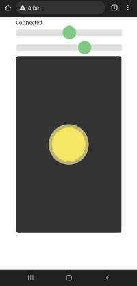

# Wifi-Hovercraft-Browser
Wifi bestuurde (vanuit een browser ) hovercraft op een ESP8266 (NodeMCU, Wemos D1 mini) of ESP32

Video: https://www.youtube.com/watch?v=TWfIe7EutRM

## Communicatie
- WifiPoint / SoftAP
- SSID = hover- + 4 laatste hexadecimale karakters van het Wifi-MAC adres van de ESP8266 chip
- Wifi-paswoord: 12345678
- App: browser (Chrome, Firefox, safari, ...)
- URL : http://192.168.4.1 maar elke andere DNS http-URL werkt ook bv. http://a.be

## App User interface 

- Bovenste regel: connectiestatus, en op ESP8266 het voltage tijdens connectie
- Bovenste slider: trim de servo
- Tweede slider: stel maximum snelheid in (links = halve kracht, rechts=volle kracht)
- Joystick: besturing servo (links-rechts) en motor (midden-boven)

## pinallocatie ESP8266
| Functie       | Pin | GPIO   |
| ------------- | --- | ------ |
| LEDCONNECTIE  | D0  | GPIO16 |
| SERVO         | D2  | GPIO4  |
| MOTOR         | D8  | GPIO15 |

## pinallocatie ESP01
Hiertoe moet je volgende regel uncommenten:
```
// #define MODE_ESP01
```

| Functie       | Pin | GPIO  |
| ------------- | --- | ----- |
| LEDCONNECTIE  | TX  | GPIO1 |
| SERVO         |     | GPIO0 |
| MOTOR         | RX  | GPIO3 |


## pinallocatie ESP32
| Functie       | GPIO   |
| ------------- | ------ |
| LEDCONNECTIE  | GPIO4  |
| SERVO         | GPIO12 |
| MOTOR         | GPIO2  |

## Arduino ESP8266 board settings
- Het is aangeraden om de meest recente Arduino ESP8266 board versie 3.0.2 niet te gebruiken, die werkt extreem slecht in combinatie met deze software. Beter is voorlopig ESP8266 versie 2.7.4 te blijven gebruiken.
- Je kan bij de board settings ook de lwIP settings aanpassen: de default "v2 Lower Memory" is goed, maar "v2 Higher Bandwidth" is beter
- Kies bij "Erase Flash" "All Flash Contents", zoniet kunnen wifi settings van een vorige sessie (of andere configuraties) blijven hangen.

## Arduino bibliotheken
Volgende bibliotheken zijn nodig:

ESP8266:
- ArduinoWebsockets by Gil Maimon, gemakkelijk te installeren vanuit de Arduino Library manager: https://github.com/gilmaimon/ArduinoWebsockets
- https://github.com/me-no-dev/ESPAsyncTCP
- https://github.com/me-no-dev/ESPAsyncWebServer

ESP32:
- AsyncTCP: te installeren van https://github.com/me-no-dev/AsyncTCP
- ESP32Servo vanuit de Arduino library manager te downloaden, dat is deze versie:  https://github.com/madhephaestus/ESP32Servo
- ArduinoWebsockets by Gil Maimon, gemakkelijk te installeren vanuit de Arduino Library manager: https://github.com/gilmaimon/ArduinoWebsockets
- https://github.com/me-no-dev/ESPAsyncWebServer

## Inspiratie
Bij het ontwikkelen van deze software werden volgende inspiratie-bronnen gebruikt: 
- [ESP32-CAM_TANK van PepeTheFroggie](https://github.com/PepeTheFroggie/ESP32CAM_RCTANK)
- [RobotZero One: ESP32-CAM-rc-car](https://robotzero.one/esp32-cam-rc-car/) met software op https://github.com/robotzero1/esp32cam-rc-car
- [Cellphone controlled RC car](https://github.com/neonious/lowjs_esp32_examples/tree/master/neonious_one/cellphone_controlled_rc_car) 
- de joystick gebaseerd op [Kirupa: Create a Draggable Element in JavaScript](https://www.kirupa.com/html5/drag.htm)

## Hoe maak je een Hovercraft?
De bouwinstructies van de hovercraft - zonder wifi verbinding- zijn te vinden op https://activiteiten.decreatievestem.be/Lasergesneden-hovercraft/.
Voor workshops hovercraft bouwen kan je terecht bij MasynMachien: https://www.instructables.com/masynmachiens-workshops/
